# Diagrama de Flujo del Proceso de Monitoreo PLD

Este diagrama muestra el flujo completo desde que se registra una operación hasta la generación de avisos a la UIF.

```mermaid
flowchart TD
    subgraph ENTRADA["📥 ENTRADA DE OPERACIONES"]
        A[("🔄 Operación<br/>Registrada")]
    end

    subgraph EVALUACION_INDIVIDUAL["⚖️ EVALUACIÓN INDIVIDUAL"]
        B{"Evaluar Operación<br/>Individual"}
        C["Convertir Monto<br/>a UMAs"]
        D{"¿Supera Umbral<br/>Identificación?"}
        E{"¿Supera Umbral<br/>Aviso?"}
        F["🔔 Generar Alerta<br/>IDEN_IND"]
        G["🔔 Generar Alerta<br/>AVISO_IND"]
    end

    subgraph ACUMULACION["📊 ACUMULACIÓN MENSUAL"]
        H["Actualizar<br/>Acumulado Mensual"]
        I["Calcular Suma<br/>Operaciones del Mes"]
        J{"¿Acumulado Supera<br/>Umbral Identificación?"}
        K{"¿Acumulado Supera<br/>Umbral Aviso?"}
        L["🔔 Generar Alerta<br/>IDEN_ACU"]
        M["🔔 Generar Alerta<br/>AVISO_ACU"]
        N["Marcar: Requiere Aviso"]
    end

    subgraph CIERRE_MES["📅 CIERRE DE MES"]
        O{"¿Fin de Período<br/>Mensual?"}
        P["Ejecutar Monitoreo<br/>Completo"]
        Q["Identificar Clientes<br/>con Aviso Pendiente"]
    end

    subgraph GENERACION_AVISOS["📤 GENERACIÓN DE AVISOS"]
        R["Generar Aviso UIF"]
        S["Asociar Operaciones<br/>al Aviso"]
        T["Calcular Fecha Límite<br/>(Día 17 mes siguiente)"]
    end

    subgraph PRESENTACION["✅ PRESENTACIÓN"]
        U["Preparar Aviso"]
        V["Enviar al Portal SAT"]
        W["Confirmar Recepción"]
        X[("📋 Aviso<br/>Presentado")]
    end

    A --> B
    B --> C
    C --> D
    D -->|Sí| F
    D -->|No| E
    F --> E
    E -->|Sí| G
    E -->|No| H
    G --> H
    
    H --> I
    I --> J
    J -->|Sí| L
    J -->|No| K
    L --> K
    K -->|Sí| M
    K -->|No| O
    M --> N
    N --> O
    
    O -->|Sí| P
    O -->|No| A
    P --> Q
    Q --> R
    
    R --> S
    S --> T
    T --> U
    U --> V
    V --> W
    W --> X

    style A fill:#e1f5fe
    style X fill:#c8e6c9
    style F fill:#fff3e0
    style G fill:#ffecb3
    style L fill:#fff3e0
    style M fill:#ffecb3
    style N fill:#ffcdd2
```

## Descripción del Flujo

### 1. Entrada de Operaciones
- Cada operación se registra en el sistema con sus datos básicos (monto, cliente, tipo, fecha)

### 2. Evaluación Individual
- Se convierte el monto a UMAs usando el valor vigente
- Se compara contra umbrales de identificación y aviso
- Se generan alertas si corresponde

### 3. Acumulación Mensual
- Se actualiza el acumulado del cliente para el mes
- Se evalúa si el acumulado supera umbrales
- Se marca si requiere aviso

### 4. Cierre de Mes
- Al finalizar el mes se ejecuta el monitoreo completo
- Se identifican todos los clientes con avisos pendientes

### 5. Generación de Avisos
- Se crea el aviso con todas las operaciones del período
- Se calcula la fecha límite de presentación

### 6. Presentación
- El aviso se prepara, envía y confirma en el portal del SAT
