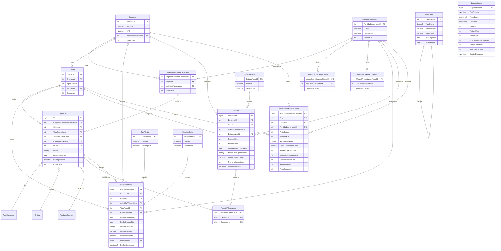

# Diagrama Entidad-Relación del Motor de Monitoreo PLD

Este diagrama muestra la estructura de las tablas y sus relaciones.

## Descripción de Entidades Principales

### Tablas de Catálogo
| Tabla | Descripción |
|-------|-------------|
| `ActividadVulnerable` | 17 actividades según Art. 17 LFPIORPI |
| `ValorUMA` | Valores históricos del UMA |
| `UmbralIdentificacionCliente` | Umbrales para identificación |
| `UmbralPresentacionAviso` | Umbrales para aviso |
| `TipoAlerta` | Tipos de alerta (IDEN_IND, AVISO_ACU, etc.) |
| `EstatusAlerta` | Estados de alerta |
| `EstatusAviso` | Estados de aviso |

### Tablas Transaccionales
| Tabla | Descripción |
|-------|-------------|
| `Operacion` | Operaciones realizadas por clientes |
| `AlertaMonitoreo` | Alertas generadas por el motor |
| `AvisoUIF` | Avisos a presentar ante la UIF |
| `AvisoUIFOperacion` | Operaciones incluidas en cada aviso |
| `AcumuladoMensualCliente` | Acumulados mensuales por cliente |
| `LogMonitoreo` | Bitácora de ejecuciones |
