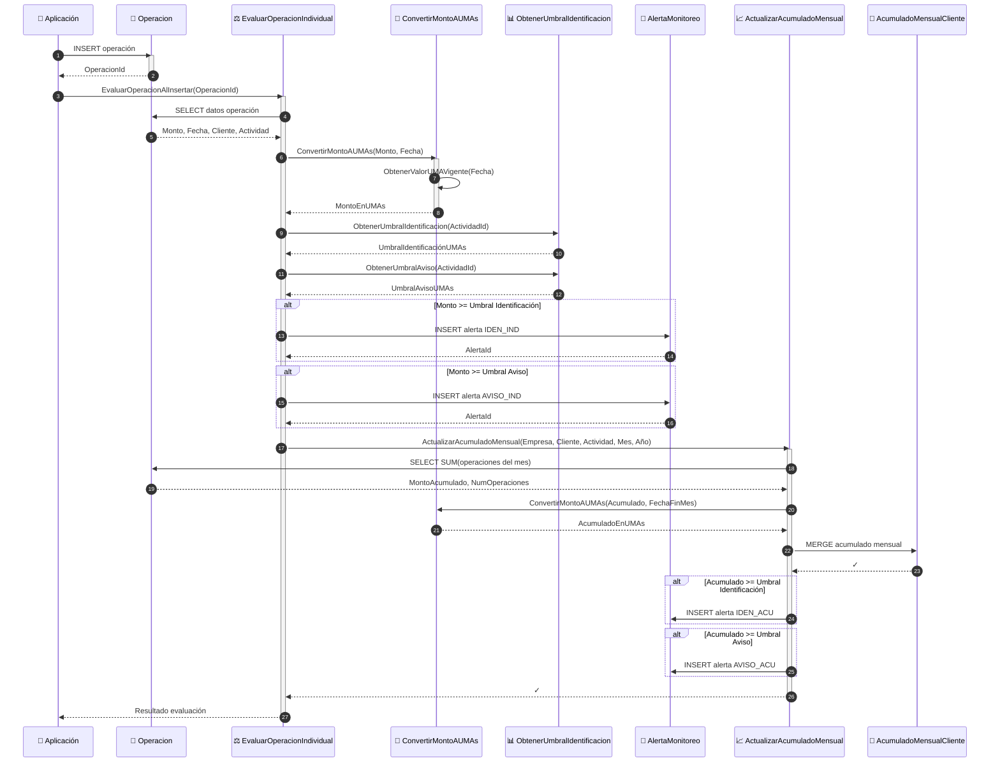
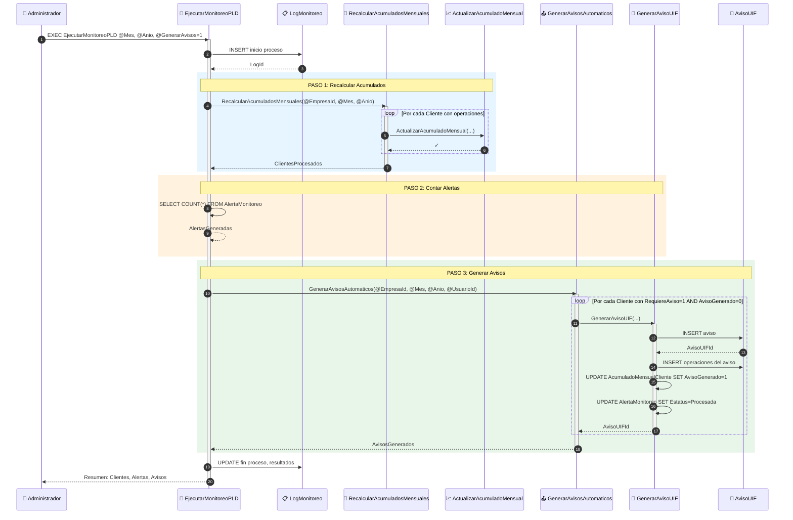
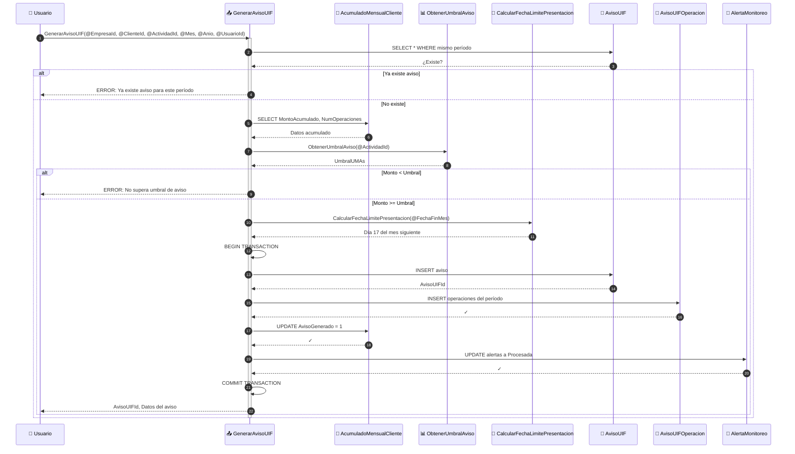

# Diagrama de Secuencia del Motor de Monitoreo PLD

Este diagrama muestra la interacción entre los procedimientos almacenados durante el proceso de monitoreo.

## Secuencia: Registro y Evaluación de Operación

## Secuencia: Ejecución del Monitoreo Completo

## Secuencia: Generación de Aviso Individual

## Notas

- Las funciones escalares (`ConvertirMontoAUMAs`, `ObtenerUmbralIdentificacion`, etc.) se ejecutan sincrónicamente
- Los procedimientos de acumulación y generación de avisos utilizan transacciones para garantizar integridad
- El motor principal registra cada ejecución en `LogMonitoreo` para auditoría
