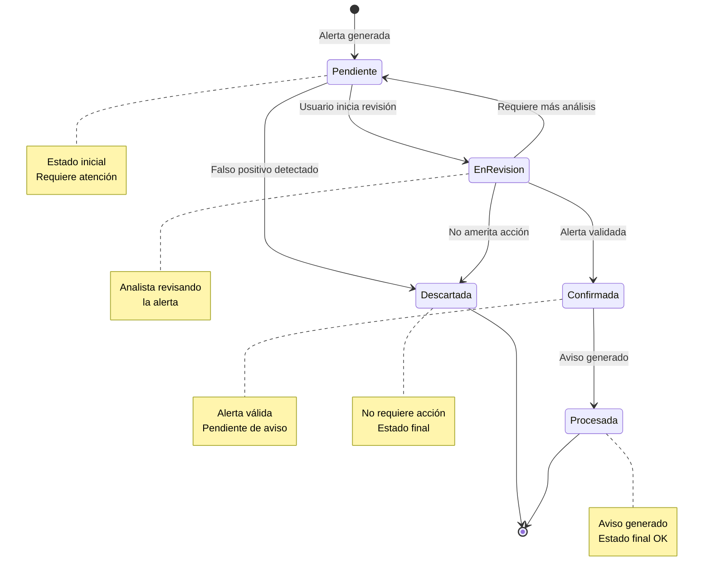
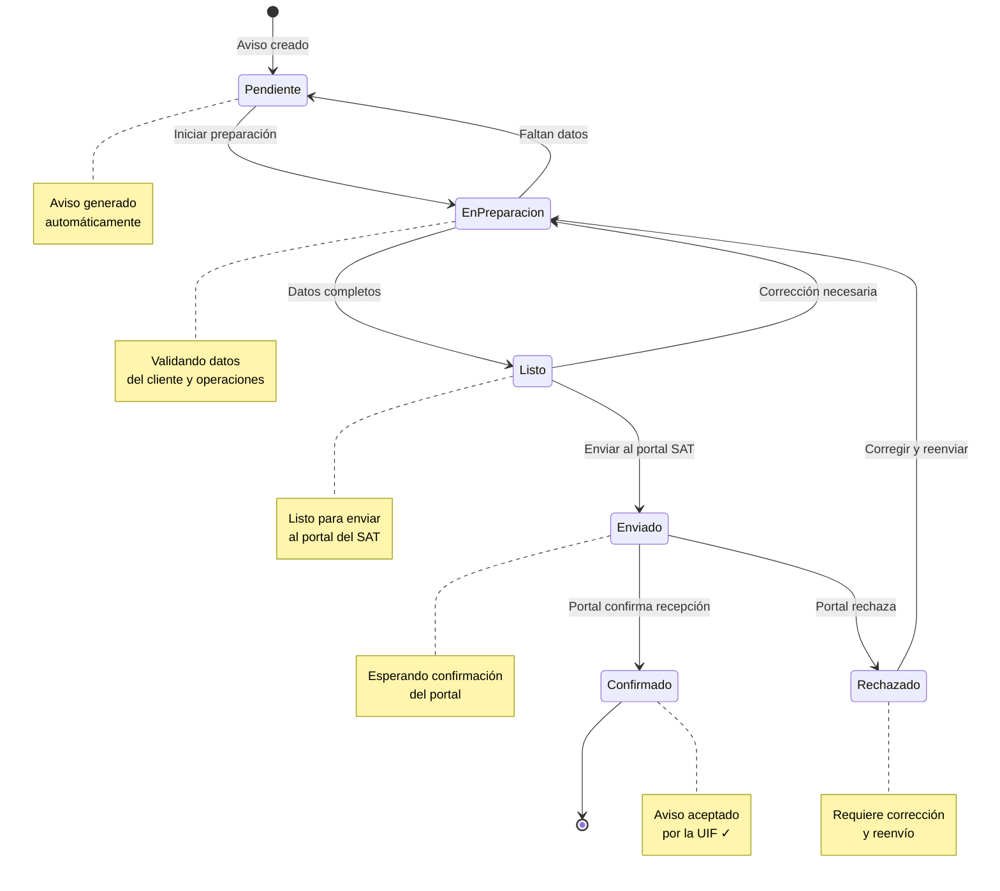
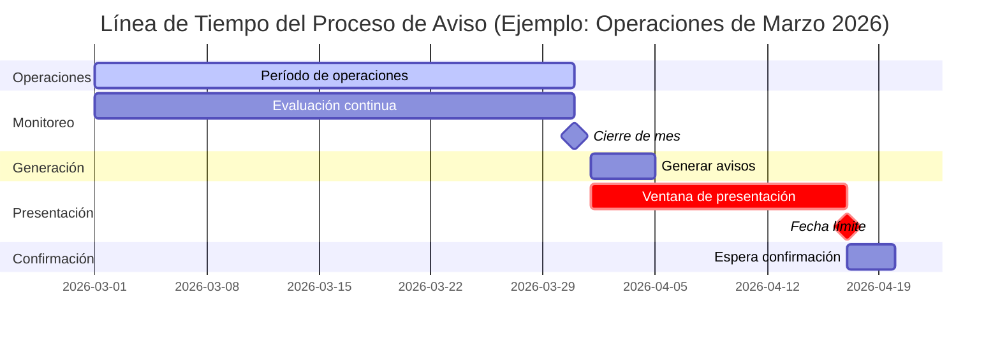
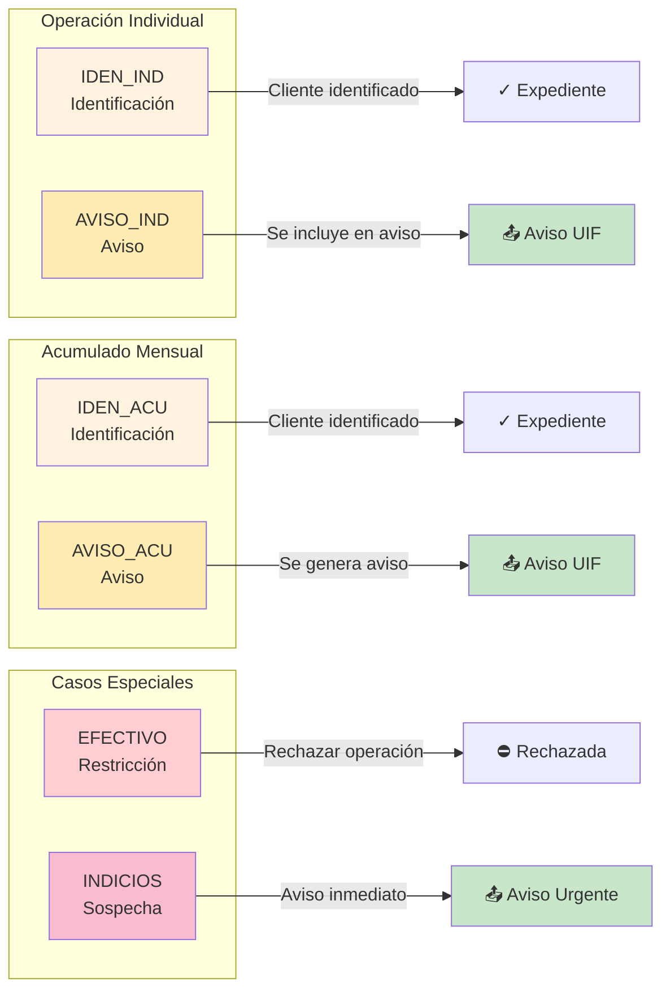

# Diagramas de Estados del Motor de Monitoreo PLD

Estos diagramas muestran el ciclo de vida de las alertas y avisos en el sistema.

## Ciclo de Vida de una Alerta

### Tabla de Estados de Alerta

| Estado | ID | Descripción | Acción Siguiente |
|--------|---:|-------------|------------------|
| **Pendiente** | 1 | Alerta recién generada | Iniciar revisión o descartar |
| **En Revisión** | 2 | En proceso de análisis | Confirmar o descartar |
| **Confirmada** | 3 | Validada, requiere aviso | Generar aviso |
| **Descartada** | 4 | No amerita acción | Ninguna (final) |
| **Procesada** | 5 | Aviso generado | Ninguna (final) |

---

## Ciclo de Vida de un Aviso

### Tabla de Estados de Aviso

| Estado | ID | Descripción | Acción Siguiente |
|--------|---:|-------------|------------------|
| **Pendiente** | 1 | Aviso recién creado | Iniciar preparación |
| **En Preparación** | 2 | Validando datos | Marcar como listo |
| **Listo** | 3 | Datos completos | Enviar al portal |
| **Enviado** | 4 | Enviado a la UIF | Esperar confirmación |
| **Confirmado** | 5 | Aceptado por la UIF | Ninguna (final) |
| **Rechazado** | 6 | Rechazado por el portal | Corregir datos |

---

## Línea de Tiempo de un Aviso

---

## Tipos de Alerta y su Transición

## Descripción de Tipos de Alerta

| Código | Tipo | Descripción | Acción Requerida |
|--------|------|-------------|------------------|
| `IDEN_IND` | Identificación Individual | Operación individual supera umbral | Integrar expediente KYC |
| `IDEN_ACU` | Identificación Acumulada | Acumulado mensual supera umbral | Integrar expediente KYC |
| `AVISO_IND` | Aviso Individual | Operación individual supera umbral aviso | Incluir en aviso mensual |
| `AVISO_ACU` | Aviso Acumulado | Acumulado mensual supera umbral aviso | Generar aviso UIF |
| `EFECTIVO` | Restricción Efectivo | Intento de pago en efectivo sobre límite | Rechazar operación |
| `INDICIOS` | Indicios | Operación sospechosa detectada | Aviso inmediato |
