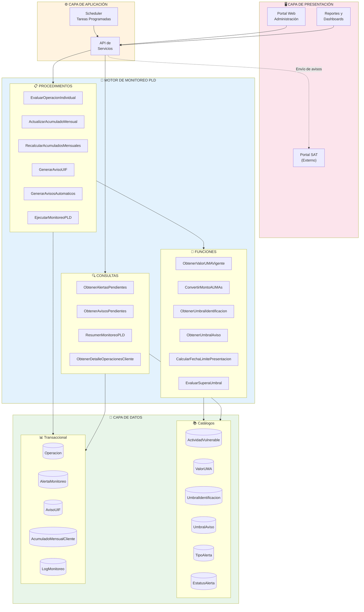
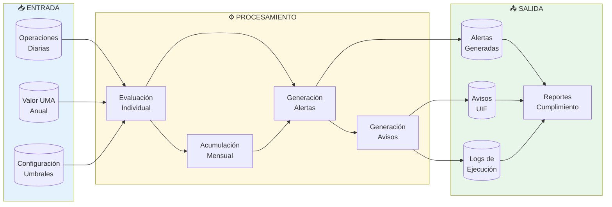
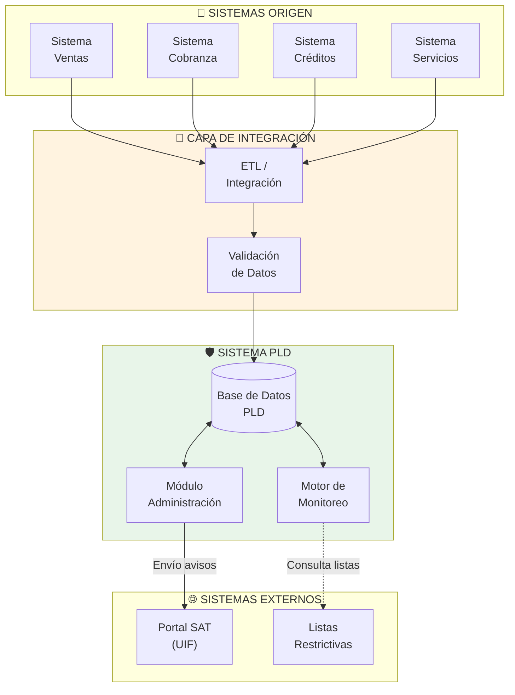
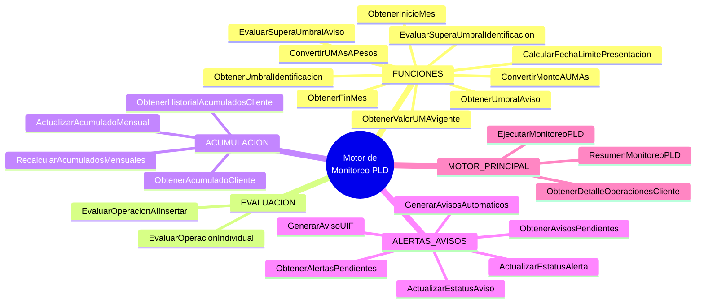

# Diagrama de Arquitectura del Motor de Monitoreo PLD

Este diagrama muestra los componentes del sistema y cómo se integran.

## Arquitectura de Componentes

## Arquitectura de Datos

## Flujo de Integración

## Componentes del Motor

## Descripción de Capas

### Capa de Presentación
- **Portal Web**: Interfaz para administradores de PLD
- **Reportes**: Dashboards y reportes de cumplimiento
- **Portal SAT**: Sistema externo para presentación de avisos

### Capa de Aplicación
- **API**: Servicios REST para operaciones del motor
- **Scheduler**: Ejecución programada del monitoreo

### Motor de Monitoreo
- **Funciones**: Cálculos y conversiones (UMA, umbrales, fechas)
- **Procedimientos**: Lógica de negocio principal
- **Consultas**: Obtención de información y reportes

### Capa de Datos
- **Catálogos**: Configuración del sistema
- **Transaccional**: Operaciones, alertas y avisos
