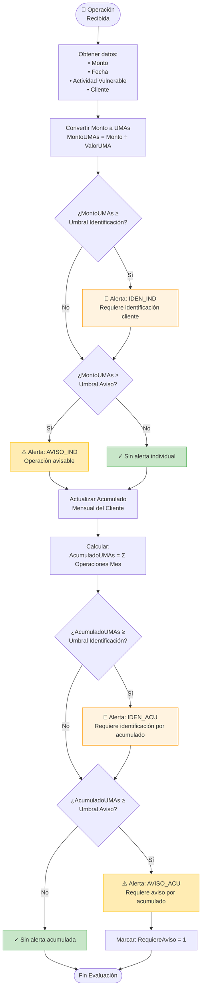
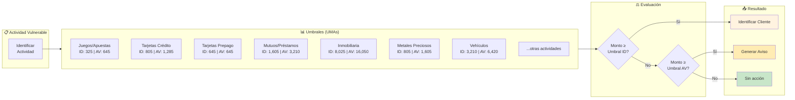
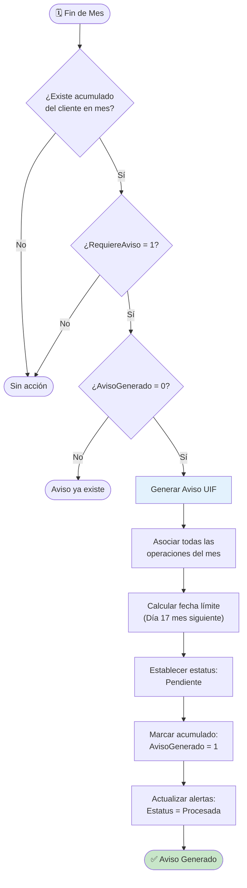
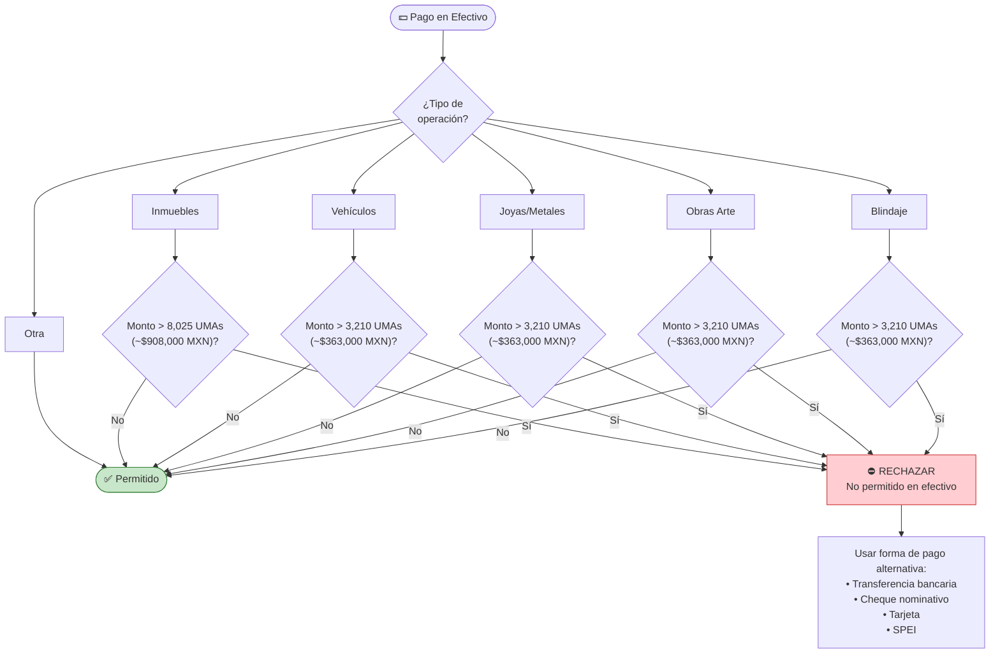
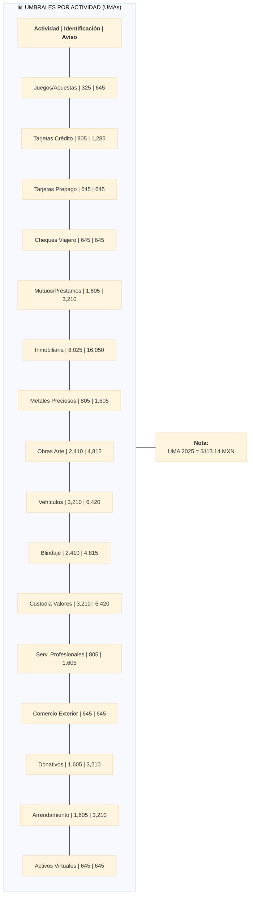

# Diagrama de Decisión - Evaluación de Umbrales

Este diagrama muestra la lógica de decisión para evaluar si una operación o acumulado requiere identificación o aviso.

## Árbol de Decisión Principal



## Matriz de Decisión por Actividad Vulnerable



## Decisión de Generación de Aviso



## Evaluación de Restricción de Efectivo



## Tabla Resumen de Umbrales



## Fórmulas Clave

| Cálculo | Fórmula |
|---------|---------|
| **Monto en UMAs** | `MontoUMAs = MontoPesos ÷ ValorUMADiario` |
| **Umbral en Pesos** | `UmbralPesos = UmbralUMAs × ValorUMADiario` |
| **Fecha Límite Aviso** | `FechaLimite = Día 17 del mes siguiente a la operación` |
| **Acumulado Mensual** | `Acumulado = Σ (Operaciones del cliente en el mes)` |

## Ejemplo Práctico

```
Operación: Venta de joyería
Monto: $250,000 MXN
Fecha: 15 de marzo 2026
ValorUMA: $113.14

Cálculo:
MontoUMAs = $250,000 ÷ $113.14 = 2,209.72 UMAs

Evaluación (Metales Preciosos):
- Umbral Identificación: 805 UMAs → 2,209.72 ≥ 805 ✓ REQUIERE IDENTIFICACIÓN
- Umbral Aviso: 1,605 UMAs → 2,209.72 ≥ 1,605 ✓ REQUIERE AVISO

Resultado:
- Generar Alerta IDEN_IND
- Generar Alerta AVISO_IND
- Fecha límite aviso: 17 de abril 2026
```
