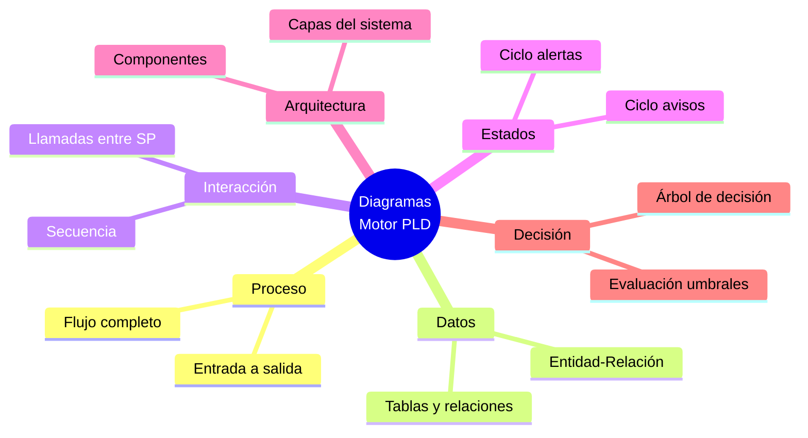

# Índice de Diagramas - Motor de Monitoreo PLD

Esta carpeta contiene los diagramas que documentan la arquitectura y funcionamiento del Motor de Monitoreo PLD para Actividades Vulnerables según la LFPIORPI.

## Diagramas Disponibles

| # | Archivo | Descripción |
|:-:|---------|-------------|
| 1 | [01_Flujo_Proceso_Monitoreo.md](01_Flujo_Proceso_Monitoreo.md) | Flujo completo del proceso desde registro de operación hasta presentación de aviso |
| 2 | [02_Diagrama_Entidad_Relacion.md](02_Diagrama_Entidad_Relacion.md) | Estructura de tablas y relaciones de la base de datos |
| 3 | [03_Diagrama_Secuencia.md](03_Diagrama_Secuencia.md) | Interacción entre procedimientos almacenados durante el monitoreo |
| 4 | [04_Diagrama_Estados.md](04_Diagrama_Estados.md) | Ciclos de vida de alertas y avisos con transiciones |
| 5 | [05_Diagrama_Arquitectura.md](05_Diagrama_Arquitectura.md) | Componentes del sistema y capas de la arquitectura |
| 6 | [06_Diagrama_Decision_Umbrales.md](06_Diagrama_Decision_Umbrales.md) | Árbol de decisión para evaluación de umbrales |

## Cómo Visualizar los Diagramas

Todos los diagramas están escritos en formato **Mermaid**, que puede visualizarse de las siguientes formas:

### Opción 1: VS Code
Instalar la extensión **Markdown Preview Mermaid Support** y abrir el archivo en modo preview (Ctrl+Shift+V).

### Opción 2: GitHub
Los archivos `.md` con diagramas Mermaid se renderizan automáticamente en GitHub.

### Opción 3: Mermaid Live Editor
Copiar el código del diagrama y pegarlo en [mermaid.live](https://mermaid.live/)

### Opción 4: Exportar a Imagen
Usar herramientas como:
- `mermaid-cli` para exportar a PNG/SVG
- Extensiones de VS Code que permiten exportar

## Resumen Visual

## Navegación

← Volver a [README del Motor de Monitoreo](../README_MotorMonitoreo.md)
